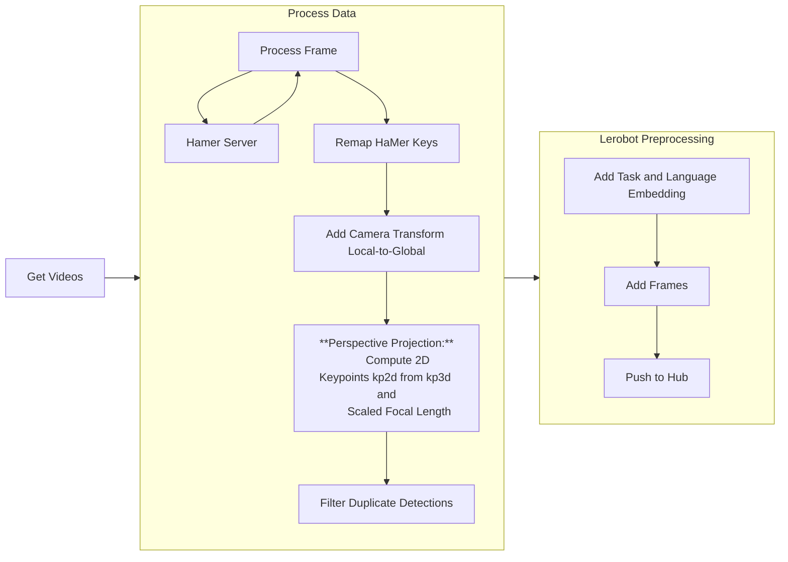
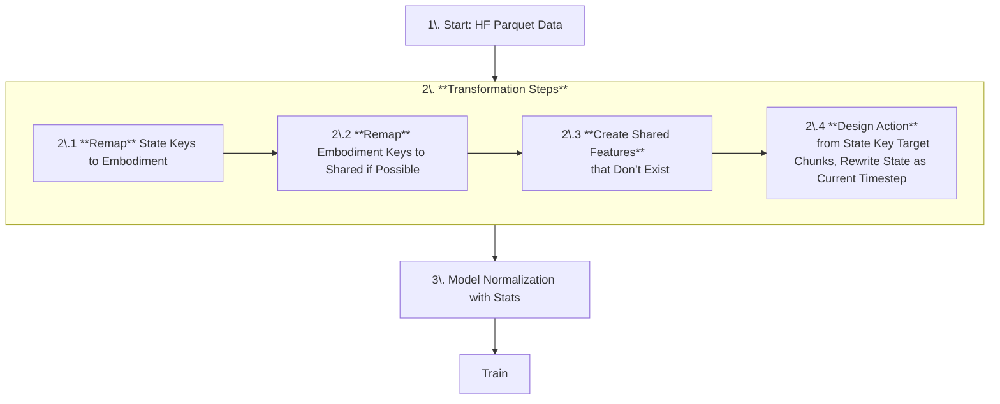

# Lerobot Dataset


## generating a Lerobot dataset



## using Lerobot to train a model



## Scripts

The files in this directory convert collected episodes into LeRobot datasets.
All scripts expose a command line interface via [tyro](https://github.com/brentyi/tyro). Run them with `--help` for full options.

### from_memmap.py

Convert raw memmap recordings to a dataset.

```bash
python -m xgym.lrbt.from_memmap \
    --dir /path/to/memmaps \
    --branch v0.1 \
    --repo-id username/dataset
```

Arguments:

- `--dir` – directory containing `.dat` files and a `task-*.npy` description.
- `--branch` – dataset branch pushed to the Hugging Face hub.
- `--repo-id` – destination repository in the format `user/name`.

### from_mano_npz.py

Processes MANO `.npz` outputs produced by the HaMer server. Uses the same
arguments as `from_memmap.py` plus connection information for HaMer:

```bash
python -m xgym.lrbt.from_mano_npz \
    --dir /path/to/npz \
    --branch v0.1 \
    --repo-id username/dataset \
    --hamer.host localhost \
    --hamer.port 8765
```

### convert.py

Example conversion script for RLDS-style datasets. Key options include
`--embodiment`, `--task` and `--version`:

```bash
python -m xgym.lrbt.convert \
    --embodiment single \
    --task lift \
    --version v0.1
```

### util.py

Helper utilities used by the other scripts. In particular,
`get_taskinfo(path)` reads a `task-*.npy` file from `path` and returns the task
and language strings.
