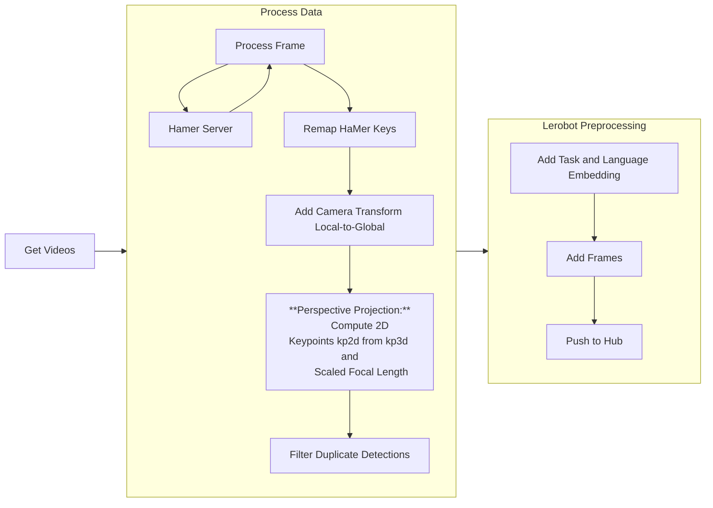
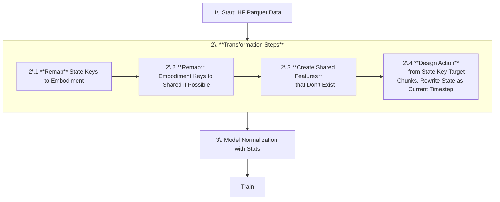

# Lerobot Dataset

## generating a Lerobot dataset

```mermaid
graph LR
    A[Get Videos] --> B

    subgraph B["Process Data"]
        B0[Process Frame]
        B0 --> C
        C --> B0
        B0 --> B1

        B1[Remap HaMer Keys]
        B1 --> B2[Add Camera Transform Local-to-Global]
        B2 --> B3[**Perspective Projection:**
        Compute 2D Keypoints kp2d from kp3d and
        Scaled Focal Length
        ]
        B3 --> B4[Filter Duplicate Detections]
    end
    C[Hamer Server]


    B --> D[Lerobot Preprocessing]

    subgraph D["Lerobot Preprocessing"]
        D1[Add Task and Language Embedding]
        D1 --> D2[Add Frames]
        D2 --> D3[Push to Hub]
    end
```

## using Lerobot to train a model

```mermaid
graph TD
    A[1\. Start: HF Parquet Data] --> B[Transformation Steps]

    subgraph B[2\. **Transformation Steps**]
        B1[2\.1 **Remap** State Keys to Embodiment]
        B1 --> B2[2\.2 **Remap** Embodiment Keys to Shared if Possible]
        B2 --> B3[2\.3 **Create Shared Features**
        that Don’t Exist]
        B3 --> B4[2\.4 **Design Action**
        from State Key Target Chunks, Rewrite State as Current Timestep]
    end

    B --> C[3\. Model Normalization with Stats]
    C --> D[Train]
```
