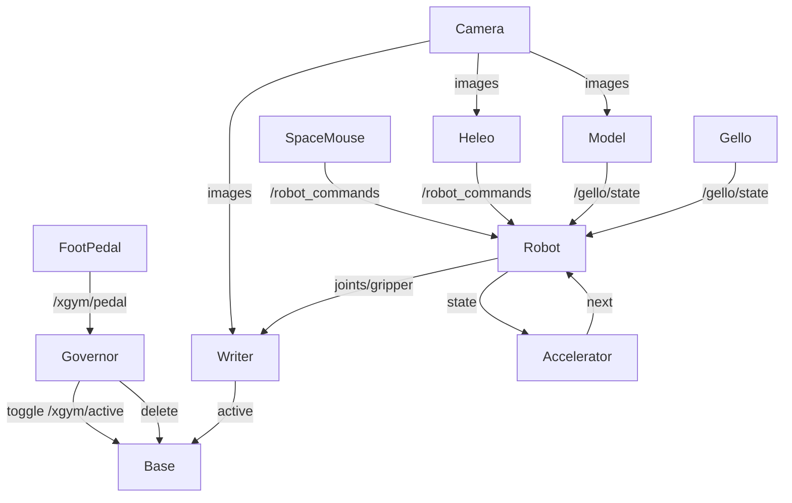

# ROS Node Flowchart

This diagram illustrates how the ROS nodes in the `xgym` package interact.

```mermaid
flowchart TD
    %% Inputs to Governor
    FootPedal -->|/xgym/pedal| Governor

    %% Governor affects shared state
    Governor -->|toggle /xgym/active| Base
    Governor -->|delete| Base

    %% Writer affects shared state
    Writer -->|active| Base

    %% Camera outputs
    Camera -->|images| Writer
    Camera -->|images| Heleo
    Camera -->|images| Model

    %% Robot logs
    Robot -->|joints/gripper| Writer

    %% Command paths
    SpaceMouse -->|/robot_commands| Robot
    Heleo -->|/robot_commands| Robot
    Model -->|/gello/state| Robot
    Gello -->|/gello/state| Robot
    Accelerator -->|next| Robot
    Robot -->|state| Accelerator
```
